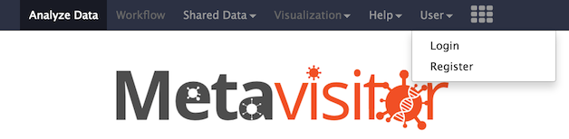
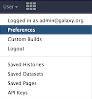

When you are done with the installation of your own Metavisitor Galaxy instance installation using either [GalaxyKickStart](metavisitor_ansible.md) or [docker](metavisitor_docker), there are a few basic things to know for web access and basic server admin operations

## 1. Connect web frontpage of your Metavisitor Galaxy
We assume that you know the IP address to reach the Metavisitor Galaxy webserver:

- if you used [GalaxyKickStart](metavisitor_ansible.md#adapt-the-ansible-inventory-file), you had to indicate this host IP in your hosts inventory file.
- if you used [docker](metavisitor_docker), you had to connect to the host machine with the appropriate IP address.

Thus, to access Metavisitor Galaxy webserver, just type this IP address in your web browser.

If you did not installed yourself the Metavisitor Galaxy instance, ask the IP address to the person who did it.

In case you decided to get the Metavisitor Galaxy served on a subdirectory do not forget to append this `/subdirectory` in your url which then looks like `http://<IP>/subdirectory`


## 2. Log to the Galaxy server using the admin credentials:

If everything goes well, you should now see the Galaxy Metavisitor home page in your web browser.

- You have to log as the admin.

To do that, go to the User menu and click `login`



This is your first login, thus the admin login is `admin@galaxy.org` and your admin password is `admin`

**However** for security, immediately change the admin password. To do this, go again in the Users menu, `Preferences`



And click the `Change your password` item in the User preferences.

## Basic admin operation: restart the Metavisitor Galaxy instance

As we will see in the [next chapter](metavisitor_configure_references.md), installations of reference genomes or additional tools in the Galaxy Metavisitor instance imply a Galaxy restart for completion. Here is how to do it.

#### restart Metavisitor Galaxy instance deployed with [GalaxyKickStart](metavisitor_ansible.md)

- Connect to the server where the Galaxy instance has been installed either through the ssh connection you have used with [GalaxyKickStart](metavisitor_ansible.md)

- in your terminal, type `sudo supervisorctl restart galaxy:`

If everything went fine you should see in your terminal
```
# supervisorctl restart galaxy:
galaxy_web: stopped
handler0: stopped
handler1: stopped
handler0: started
handler1: started
galaxy_web: started
```
That's it, the Galaxy instance has restarted.

#### restart Metavisitor Galaxy instance deployed with [docker](metavisitor_docker)

- Connect to the server where the Galaxy instance has been installed either through the ssh connection you have used with [GalaxyKickStart](metavisitor_ansible.md)


- connect to you docker host using ssh
- type `docker ps`. You should see your Metavisitor docker container running and the name of the container in the NAMES column
- enter into your container by typing:

`docker exec -it <name_of_the_container> bash`
- in the docker session you can now type `sudo supervisorctl restart galaxy:`

and see also, within the container:
```
# supervisorctl restart galaxy:
galaxy_web: stopped
handler0: stopped
handler1: stopped
handler0: started
handler1: started
galaxy_web: started
```
That's it, the Galaxy instance has restarted. you can leave the container by typing `exit`

