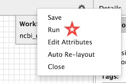
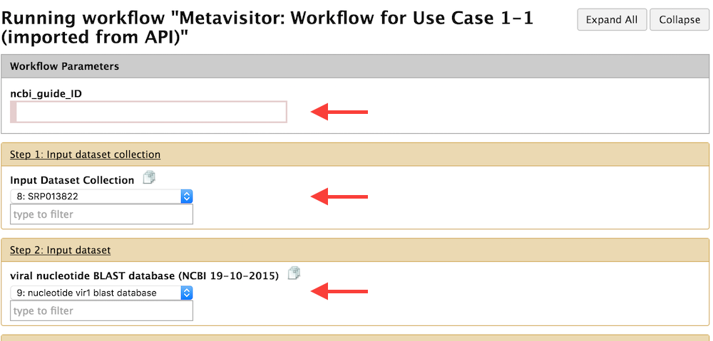
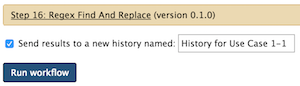
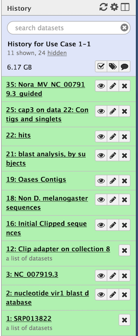

# Histories for Use Cases 1-1, 1-2, 1-3 and 1-4

As you will see, Histories 1-1, 1-2 and 1-3 are generated in the same way, using their corresponding workflows. These workflows are available in your Galaxy top menu. An important thing to remember is that you will always start **from** the `Input data for Use Cases 1-1, 1-2, 1-3 and 1-4` history, run the appropriate workflow, **sending the outputs of the workflow in a new history** named accordingly.

## History for Use Case 1-1.

#### 1. As aforementioned, ensure that you are in the `Input data for Use Cases 1-1, 1-2, 1-3 and 1-4` history.
You can always control this by using the top menu **Users** --> **Saved History** and selecting the desired history. If you don't see the History right bar, just click in addition the top menu **Analyze Data**

#### 2. Select the appropriate workflow
- Click now on the **Workflow** top menu
- Select the workflow **"Metavisitor: Workflow for Use Case 1-1 (imported from API)"** and to see the workflow, select the submenu **"Edit"**
- Now that you see the workflow, you can directly execute it by clicking the top right wheel icon and selecting **"Run"**
    
    
    
    
#### 3. Select the appropriate parameters before running the workflow

You now see a page with all the workflow steps, whose top part looks like:
    

- As pointed by the first red arrow, a parameter has to be provided at runtime of the workflow: the **ncbi_guide_ID**. In this Use Case as in the other 1-2 and 1-3 Use Cases, you will paste in the **ncbi_guide_ID** field the `NC_007919.3_`value. This is the NCBI identifier for the Nora virus genome sequence which will be retrieved from Genbank during the workflow and used as a guide for the final reconstruction of the Nora virus genome sequence that is "present" in the analyzed small RNA sequencing datasets.

- You have to select an Input dataset collection for Step 1 (second red arrow). However, as there is only one dataset collection in the input history (the one we have prepared in the [previous chapter](use_cases_input_data/#history-with-input-data-for-use-cases-1-1-1-2-1-3-and-1-4)), there is no other option in the menu than "**SRP013822**".
    
- You have to select the viral nucleotide Blast database for Step 2. Here again there is indeed nothing else to select than the "**nucleotide vir1 blast database**", just because there is only one dataset in the input history with the "blast database" type.

- You can review the other steps of the workflow. But there is no other selection to perform before running the workflow.

#### 4. Running the workflow **_sending the outputs in a new history_**

We are almost ready, but before clicking the "**Run Workflow**" button there is an important thing to do:
- Check the "**Send results to a new history**" checkbox as shown Here

- And edit the field to "History for Use Case 1-1"
- **You can now click the "Run workflow" button.**
This trigger the workflow run. After a few seconds (may be take a while for complex workflows), you will see an alert that the workflow is started, and a link to navigate to the newly created history.

When the workflow has finished, if you navigate to the created "History for Use Case 1-1", you should see:

Note that 24 datasets have been hidden by the workflow for clarity. You just have to click on the "hidden" link to unhide these datasets

## Histories for Use Cases 1-2 and 1-3

Histories for Uses Cases 1-2 and 1-3 are produced in almost the same way as History for Use Case 1-1.

Do exactly as described for Use Case 1-1 and
- Remember to go back to the `Input data for Use Cases 1-1, 1-2, 1-3 and 1-4` history and be sure you are going to run the workflow from that history.
- **Select the appropriate workflow** !
- Remember to Check the "**Send results to a new history**" checkbox, rename the new history appropriately before pressing the "**Run workflow**" button

## History for Use Case 1-4

Before running the workflow for Use Case 1-4, we need to collect datasets generated in Histories for Use Case 1-1, 1-2 and 1-3 and send them in our `Input data for Use Cases 1-1, 1-2, 1-3 and 1-4` history.

This is because the purpose of the workflow for Use Case 1-4 is to remap the raw read sequencing datasets to the viral genomes generated in the previous histories as well as to 2 different Nora virus genomes deposited in Genbank (NC_007919.3 and JX220408).

Thus, go back to the `Input data for Use Cases 1-1, 1-2, 1-3 and 1-4` history and

1. Use the `Retrieve FASTA from NCBI` Metavisitor tool to retrieve the NC_007919.3 sequence.
- Use the `Regex Find And Replace` tool on the _Retrieve FASTA from NCBI (Nucleotide) with queryString 'NC_007919.3'_ dataset as an input, and put `>gi\|346421290\|ref\|NC_007919.3\|_Nora_virus,_complete_genome` as Find Regex parameter and `>NC_007919.3` as Replacement parameter. This is just to change the header of the FASTA file and make it more readable.
- Use the `Retrieve FASTA from NCBI` Metavisitor tool to retrieve the JX220408 sequence.
- Use the `Regex Find And Replace` tool on the _Retrieve FASTA from NCBI (Nucleotide) with queryString 'JX220408'_ dataset as an input, and put `>gi\|402295620\|gb\|JX220408.1\|_Nora_virus_isolate_FR1,_complete_genome` as Find Regex parameter and `>JX220408.1` as Replacement parameter.
- click on the top wheel history icon, select `Copy Datasets`; select "History for Use Case 1-1" as a Source History, click on the last dataset of the history (Nora_MV_NC_007919.3_guided), select "Input data for Use Cases 1-1, 1-2..." as Destination History, and click "Copy History Items".
- Repeat the previous operation for History for Use Case 1-2, selecting the last "Nora_raw_reads_NC_007919.3_guided" dataset.
- and Repeat the previous operation for History for Use Case 1-3, selecting the last "Nora_Median-Norm-reads_NC_007919.3_guided" dataset.

