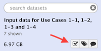
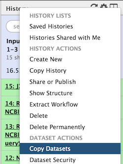

We are now entering into real analyses using Metavisitor.
These analyses as well as their biological context are are presented as **Use Cases** in the [metavisitor article](http://dx.doi.org/10.1101/048983). We invite readers of this manual to refer to this article if they need to better understand the biological context of the described procedures.

In this section, we are going to create step by step a Galaxy history that contains the input data required to run the workflows for Use Cases 1-1, 1-2, 1-3 and 1-4

# History with input data for Use Cases 1-1, 1-2, 1-3 and 1-4

1. Create a new history and rename it "Input data for Use Cases 1-1, 1-2, 1-3 and 1-4"
2. import SRP013822 datasets
    - Use the tool `Extract reads in FASTQ/A format from NCBI SRA` and fill the SRR accession field with the first EBI SRA identifier **SRR515090**
    - repeat the exact same operation with the tool `Extract reads in FASTQ/A format from NCBI SRA` and the identifiers **SRR513993, SRR513992, SRR513990, SRR513989, SRR513981, SRR513901**
    - for the 7 datasets retrieved from EBI SRA, change the datatype **fastq** to **fastqsanger**:
    click on the pencil icon of the dataset, click the tab Datatype, and select fastqsanger in the New Type menu
3. Create a dataset collection **SRP013822**
    - Click on the checked box icon at the top of history bar as indicated below
    
    
    
    - Select the 7 datasets
    - Select **Build Dataset List** in the menu **For all selected...**
    
    
    
    - and type **SRP013822** in the Name field and click `Create list`
    - you can leave the checked datasets view by clicking again the check box in the history top menu
    
4. copy the vir1 blast database that we have prepared earlier in the [Reference](metavisitor_configure_references.md#3-prepare-blast-databases) history.
    - To do so, click on the little wheel icon in the history top menu (in the history right bar).
    
    
    
    - Select "Copy Datasets"
    - In the open page, select "References" in the Source History menu, check the "nucleotide vir1 blast database" dataset; select "Input data for Use Case 1_1, ..."; and click the "Copy History Items".
    - if you refresh the history, you will see the "nucleotide vir1 blast database" dataset showing up.
    
That is all for the moment. We will latter add datasets in the history `Input data for Use Cases 1-1, 1-2, 1-3 and 1-4`. However, these datasets do no exist yet: this will be produced by the Use Cases 1-1, 1-2, 1-3 workflows !